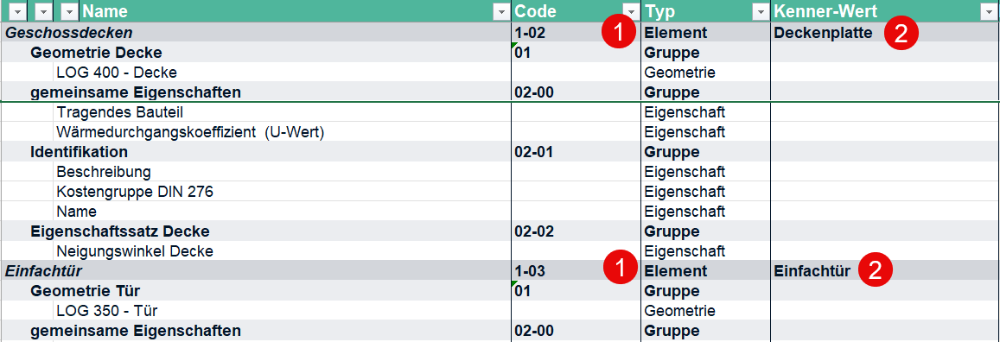
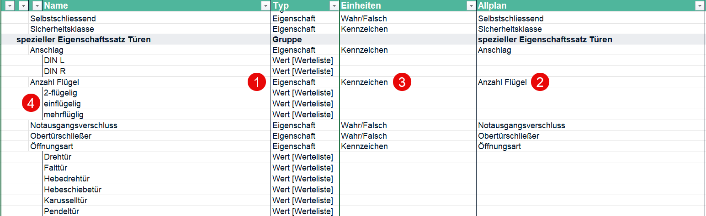
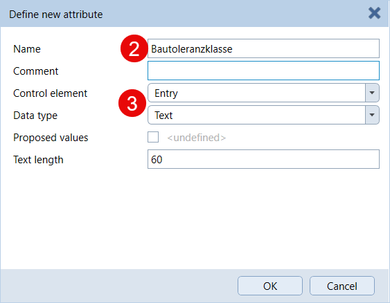
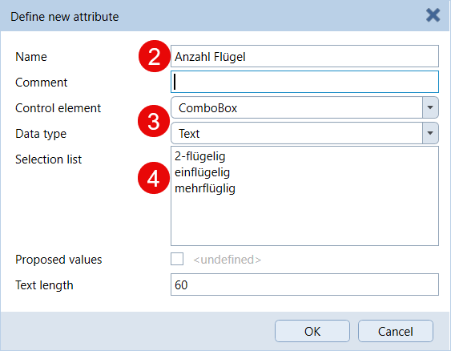
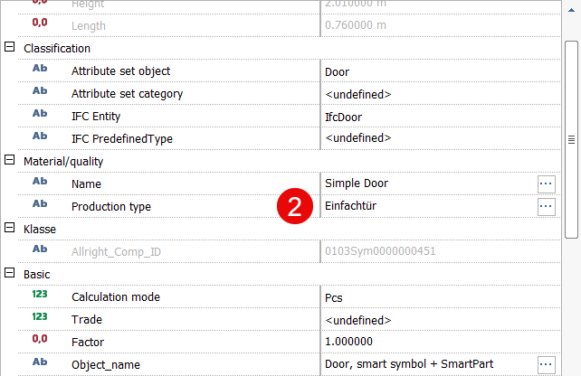
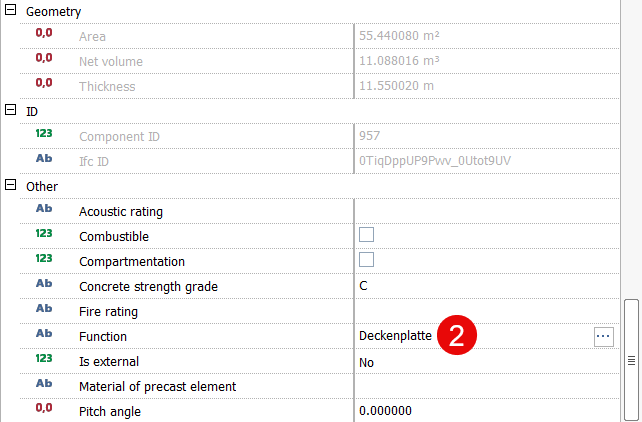
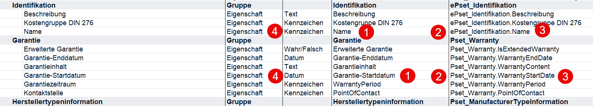
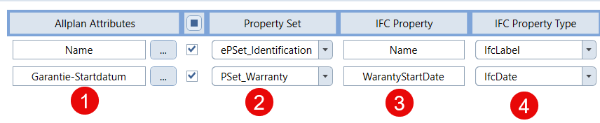
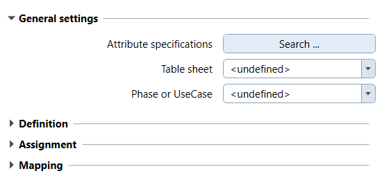

# BimQ Connection

The PythonPart enables the to take over model requiremtes mainly for object information and  attribute defined in **BimQ** in ALLPLAN. Most of the necessary steps can be executed more or less automatically:
- **define** the required attributes
- **assign** attributes to dedicated objects
- **create** an adapted a **mapping table** for the IFC export

An additional filter allows the adoption of the attributes to the range needed for the current **project phase** or **UseCase**.

An **Excel file** from the **BimQ** platform exported with the **transfer mode ALLPLAN** serves as basis for the individual steps. It is usually delivered by the client.

As this is a mandatory premise such file has to be available **before** running the PythonPart. It can be saved in an arbitrary folder and is selected during the runtime

## Explanation of the table

Depending on the project and its aim the size of the Excel file may differ and also include several sheets. Nevertheless they are all structured in the same way and contain all parameters and values necessary for the PythonPart

The **"Typ"" column** is of special interest as it defines which kind of information the row contains
- **Gruppe** specifies a collection / PSet of attributes
- **Element** defines the object / building component
- **Eigenschaft** contains attribute specifications
- **Wert** lists the Pulldown content of ComboBox attributes

When the PythonPart is executed it always accesses the information needed in the individual steps

### for attribute definition

all rows marked with **Eigenschaft** in the **Typ** column contain a definition with its necessary parameters

- Name
- Typ
- optional Einheit
- optional Werteliste

and are created as new userdefined attributes, as long as the do not exist already.

 
 

  

### for the assignment

in the rows marked as **Element** in the column **Typ** the relvant value of the identifyer attribute is listed in the **Kenner-Wert** column. The properties listed in the following **Eigenschaft** rows will be assigned to all objects that have been classified accordingly. The ALLPLAn attribute used as identifyer is free of choice
> ⚠️IMPORTANT\
The attribute that serves as identifyer and its appropriate values have to be assigned ond filled **prior** to the assignment step

 

  

In addition, the parameters defined in the **IFC ...** column are taken over into the **IFC Entity** and **IFC PredefinedType** attributes in ALLPLAN

### regarding the mapping table

the particular **PSet** which a special **Eigenschaften** belongs to is usually determined in the first part of the  **IFC ...** column wheras the second part contains the attribute name.

The mapping can either be general for all objects or customized for a special **IfcEntity**, dependent upon the value in the **IFC ...** column. If it contains a speccial class (like IfcPipe or IfcFooting) this will be taken into account, if it contains **IfcBuildingElementProxy** it will be considered as a general mapping.

 

 

## Installation

The PythonPart **BimQ_Connection** can be installed directly from the PluginManager in ALLPLAN. 

Alternatively, the corresponding ***.allep** package can be downloaded from the [release page](https://github.com/AnkeNiedermaier/bimq-connection-public/releases). ***.allep** files are ALLPLAN internal setups that can be installed via drag and drop into the program window.

At least the version 2026 is needed to install the PythonPart.

## Installed PythonPart Scripts

If the installation was successfull, the PythonPart **BimQ_Connection.pyp** can be found
in the ALLPLAN Library:
`Office` → `Library` → `ALLPLAN GmbH` → `BimQ_Connection`

Besides the library, the PythonPart can also be found in the ActionBar in a newly created task area **BimQ Connection** inside the task **Plug-ins**.

## Workflow
In general, all installed PythonParts can be found in the Library palette, no matter if an additional ActionBar entry is created or not. They are started either with a **double-click** on the icon or per **Drag and Drop** into the viewport. This shows the corresponding Properties palette and executes the underlying skripts.

The central part **General settings** at the top is relevant for each step and contains buttons and pulldowns to load the Excel file and select the relevant table sheet and phase or use case

 

Similar to the complete workflow the lower part is divided into the three steps
- **Definiton**
- **Assignment**
- **Mapping**

which also contain buttons to set the relevant parameters. No matter which of them is executed, the **first step** always has to be **loading the Excel file**, as all the others rely on its information
They can either be executed consecutively in one or separate from each other in individual workflows

